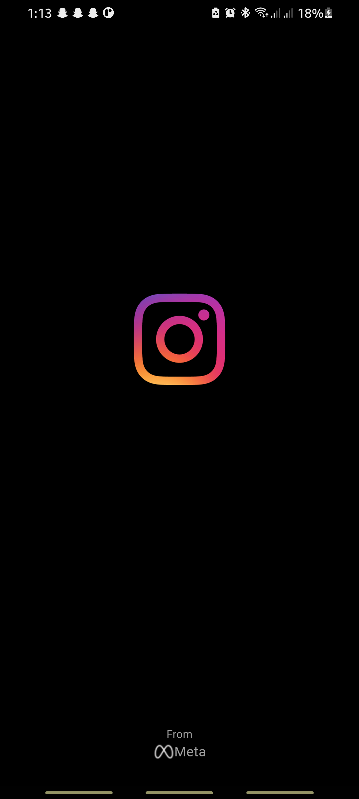
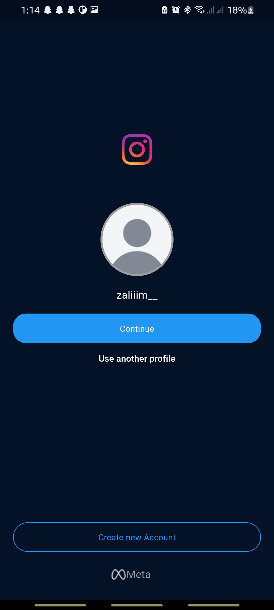
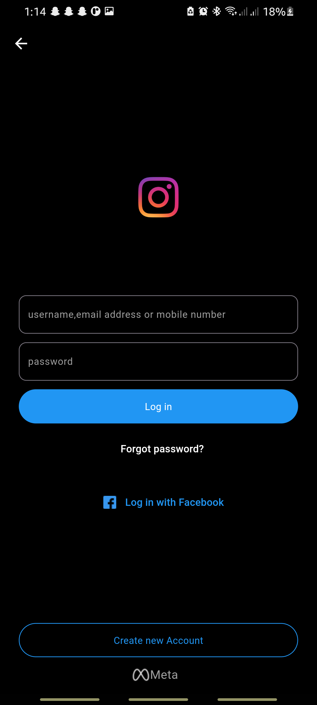
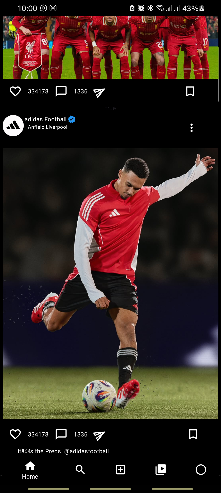

# Instagram Clone 📸  


<<<<<<< HEAD
## 📸 Screenshots 

  
  
  
=======


## 🛠 Tech Stack  
- **Flutter** - Frontend UI  
- **BLoC** - State Management  
- **Firebase** - Backend & Realtime Database  
- **Cloud Storage** - Image Upload  

## 🔥 How to Run?  
1. Clone the repo:  
   ```sh
   git clone https://github.com/zalim-388/instagram.git
   cd instagram
